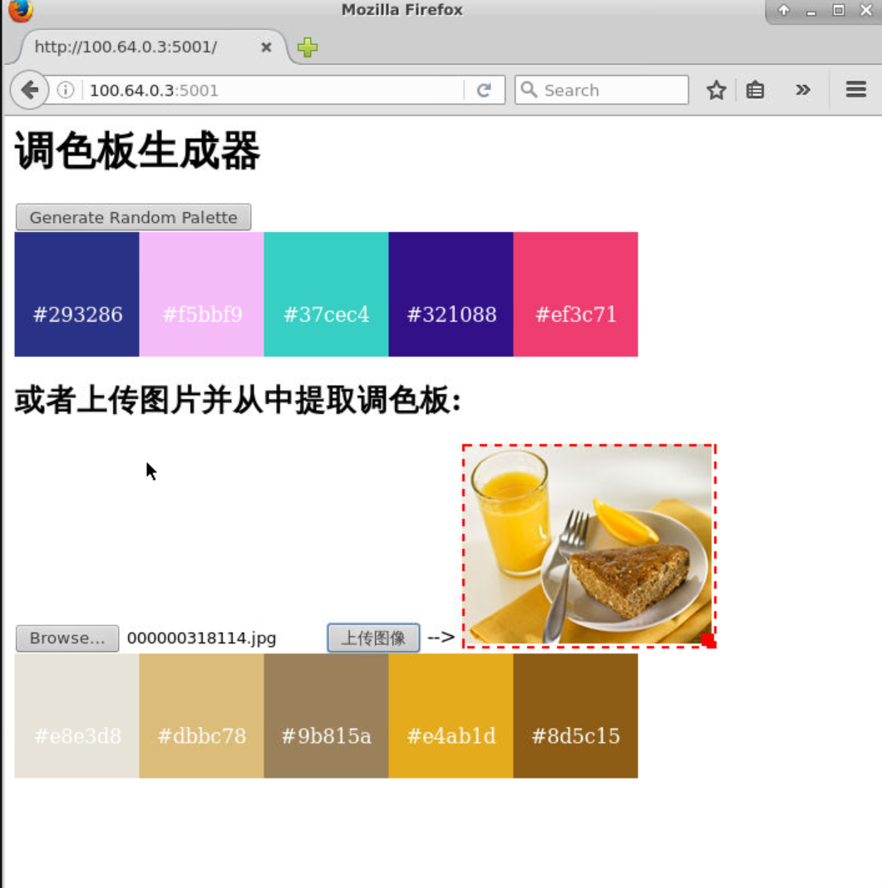

# 项目描述

这是一个基于Python和Flask的Web应用程序，用于生成和显示颜色调色板。该应用程序有两个主要功能：通过点击按钮生成随机颜色调色板，以及通过上传图片生成该图片的主要颜色调色板。同时，应用程序也实现了一些复杂的JavaScript交互，例如鼠标悬停时的动画效果，以及能够复制颜色值到剪贴板等功能。

# 项目运行效果截图

# 功能

1. 生成随机颜色调色板: 用户可以点击按钮生成随机颜色调色板。
2. 上传图片生成调色板: 用户可以上传图片，应用程序会分析图片的主要颜色并生成调色板。
3. 颜色复制功能: 用户可以点击颜色块将颜色值复制到剪贴板。

# 依赖

- Python 3
- Flask
- jQuery
- JavaScript

# 使用

1. 克隆或下载此项目。
2. 在项目根目录下运行`python app.py`来启动应用程序。
3. 打开浏览器，访问`http://localhost:5000/`来查看和使用应用程序。

# 注意

这个项目仅作为一个演示和学习用途，未经过全面的错误检查和优化。如果你想将其用于生产环境，请确保进行充分的测试和修改。

# 个人信息

[TODO: 此处填写个人信息]
- 学号: 202452320111
- 年级: 2024
- 专业: 智能科学与技术
- 班级: 一班

